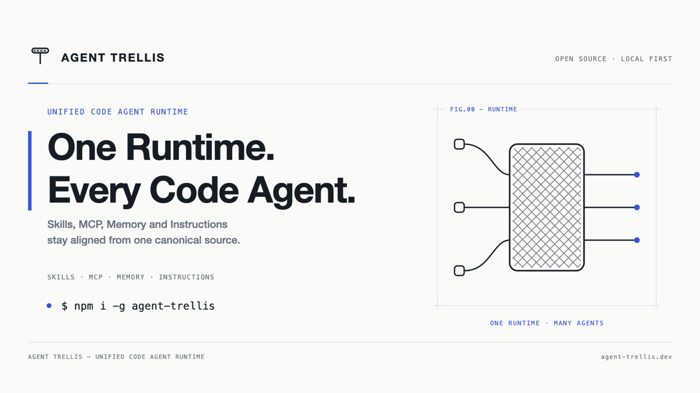

# Trellis

<p align="center">
  
</p>

<p align="center"><strong>Unified Code Agent Runtime</strong></p>

One canonical source for Skills, MCP, Memory, and shared instructions —
projected safely into Claude Code, Codex, Kiro, pi, Kimi Code, and ZCode.

> 中文：一个 canonical source 统一管理多个 Code Agent 的 Skill、MCP、Memory
> 与共享指令，支持预览、备份与回滚。



## Quick start

```bash
npm install -g agent-trellis

trellis onboard --dry-run   # preview: migration source, managed agents, MCP, memory
trellis onboard             # apply — every write is backed up automatically
trellis doctor              # verify state, any time

# import a GitHub Skill into Trellis canonical storage, then sync it
npx trellis add mattpocock/skills --skill loop-me --dry-run
```

Something went wrong? `trellis rollback` inverts the last run.

## How it compares

| | Skills / Rules | MCP | Memory | Secret hygiene | Agents covered |
|---|---|---|---|---|---|
| [ai-rules](https://github.com/block/ai-rules), [skills-link](https://github.com/shanliuling/skills-link), [agent_sync](https://github.com/yelmuratoff/agent_sync) | ✅ | ❌ | ❌ | ❌ | Many — but not Kiro or pi |
| [skillshare](https://github.com/runkids/skillshare), [skills-hub](https://github.com/qufei1993/skills-hub) | ✅ skills only | ❌ | ❌ | ❌ | Codex, Claude, … |
| [mcp-router](https://github.com/mcp-router/mcp-router) | ❌ | ✅ desktop router | ❌ | config in its own dashboard | — |
| [MetaMCP](https://github.com/metatool-ai/metamcp), [mcp-hub](https://github.com/ravitemer/mcp-hub) | ❌ | ✅ aggregator | ❌ | ❌ | — |
| [cli-agent-orchestrator](https://github.com/awslabs/cli-agent-orchestrator) | ❌ | ❌ | ❌ | ❌ | Runs agent fleets, doesn't unify config |
| **Trellis** | ✅ | ✅ native config, Runtime, or hub mode | ✅ shared memory + handoffs | ✅ references only, `secrets audit` | Claude Code, Codex, Kiro, pi, Kimi Code, ZCode |

Sync tools stop at rules and skills. MCP routers manage servers but hold their
own config — a second source of truth (we hit real token drift with exactly
that setup). Trellis is the only one treating Skills + MCP + Memory +
instructions as **one** canonical system, and the only one covering Kiro and
pi. Full landscape survey: [`docs/research.md`](docs/research.md).

## Design principles

1. **One canonical source, many adapters** — agent-native configs are
   generated artifacts, never hand-edited.
2. **No plaintext secrets, ever** — outputs hold variable references;
   `trellis secrets audit` rejects raw values.
3. **Verify, don't assume** — every adapter claim is backed by an executed
   probe in isolated Docker sandboxes, never a developer's own dotfiles.

Trellis aligns with the emerging [`.agents Protocol`](https://dotagentsprotocol.com)
draft rather than inventing another standard.

## Docs

- [Overview](docs/overview.md) ([中文](docs/overview.zh-CN.md)) — what it is and why
- [Getting started](docs/getting-started.md) — every command, with example output
- [Architecture](docs/architecture.md) — what we build vs. deliberately reuse
- [Research](docs/research.md) — the full competitive landscape

## Status

**Early, pre-1.0.** All CLI commands are implemented, unit-tested, and verified
against real agents in isolated containers. Known limitations are listed in
[Getting started](docs/getting-started.md); please open an issue for anything
a clean-room sandbox wouldn't catch.

## License

MIT — see [`LICENSE`](LICENSE).
