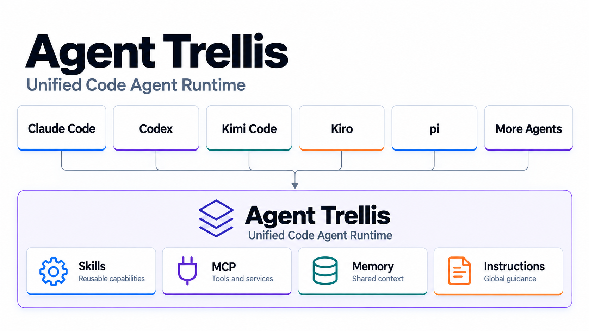

# Trellis

<p align="center">
  
</p>

<p align="center"><strong>Unified Code Agent Runtime</strong></p>

Trellis gives Claude Code, Codex, Kiro, pi, and Kimi Code one Runtime for
Skills, MCP, Memory, and shared instructions.

> 中文：Trellis 是统一的 Code Agent Runtime，为多个 Code Agent 提供一致的
> Skill、MCP、Memory 与共享指令能力。

Trellis does not replace an Agent's native runtime. It manages one canonical
source and generates verified native or Runtime projections from it.

[Read the product overview →](docs/overview.md)



## Install

```bash
npm install -g agent-trellis
```

## Quick start

```bash
trellis onboard --dry-run
trellis onboard
trellis doctor
```

Use the dry-run to review migration source, managed Agents, MCP mode, and
Memory before applying. See [`docs/overview.md`](docs/overview.md) for the
short product explanation and [`docs/getting-started.md`](docs/getting-started.md)
for the complete workflow.

## Why

By late 2026 the "sync my AI agent rules across tools" space is crowded — at
least seven open source projects do it (`block/ai-rules`, `ai-rules-sync`,
`skillshare`, `skills-hub`, `skills-link`, `agent_sync`, and others). None of
them cover **Kiro** or **pi**, and none of them go past rules/skills into MCP
servers, shared memory, and secret hygiene as one coherent system. That's the
gap Trellis fills — see [`docs/research.md`](docs/research.md) for the full
landscape survey and [`docs/architecture.md`](docs/architecture.md) for what we
build versus what we deliberately reuse.

Trellis aligns with the emerging [`.agents Protocol`](https://dotagentsprotocol.com)
draft rather than inventing a sixth competing standard, and is likely its first
working implementation.

See [`docs/getting-started.md`](docs/getting-started.md) for the detailed
walkthrough — example output for each command, what each `migrate`/`sync`
conflict action means, and troubleshooting.

**One command:**

```
trellis onboard
```

Creates canonical source, detects which of Claude Code/Codex/Kiro/pi/Kimi Code are on
this machine, then resolves two independent choices: a **migration source**
(read from — auto-selected if only one present agent has real content,
prompted with a numbered choice if more than one, skippable if starting
fresh; pass `--agent <id>` to skip the prompt) and a **managed set** (written
to — zero or more agents, chosen explicitly; pass `--manage <ids>` or
`--manage none` to skip the prompt). The source is **not** managed by
default — importing from Claude Code doesn't mean Trellis starts writing to
Claude Code too, unless you explicitly include it. Selecting an agent that
isn't installed yet (e.g. pi) is itself the authorization to install it —
one confirmation, then a real `npm install -g <package>`; Kiro has no CLI
package and is refused with its download URL instead. Once resolved, it
runs `migrate`, `sync`, `mcp sync`, and `secrets audit` against the managed
set — the whole onboarding path in one command, no follow-up commands to
type by hand. If no agent is detected, it prints each supported agent's
real install command/URL and stops — it never installs anything on its own
initiative. Add `--dry-run` to preview the whole thing with zero writes.

Onboarding only adds to the existing managed set. To deliberately narrow or
replace Trellis's future write boundary without touching an agent's current
native state, use `trellis manage list|set|add|remove`; these mutations are
dry-runnable and backed by `trellis rollback`.

```
trellis onboard --agent claude-code --manage pi
```

## Trellis itself as a Skill

Trellis ships one package-owned Skill, `trellis-runtime`, with two layers:

| Layer | Who uses it | What it covers |
| --- | --- | --- |
| Takeover and migration | the operator, with Agent assistance | inspect, dry-run, choose a migration source, choose the managed boundary, select Skills/MCP/Memory, authorize OAuth, sync, audit, verify, and rollback |
| Runtime consumption | every managed Agent | discover and read canonical Skills, inspect shared Memory and global instructions, diagnose MCP, see managed Agents, and inspect or explicitly confirm task handoffs |

`trellis init` bootstraps this Skill into
`~/.trellis/skills/trellis-runtime/SKILL.md`. After an Agent is managed,
`trellis sync` delivers it in the Agent's native Skill location for native or
`both` delivery. For Runtime-only delivery, `SkillProvider` exposes the same
canonical Skill through the `trellis` MCP Runtime; Kimi Code uses
`trellis kimi` to prevent a second native Skill discovery path. This is one
canonical Skill, not a copied per-Agent variant.

Before takeover, the Skill cannot be consumed from an Agent that has not been
connected to Trellis yet; use the CLI and
[`docs/getting-started.md`](docs/getting-started.md#trellis-runtime-skill)
for the first-run path. After takeover, the Skill is the Agent's operating
guide for Trellis-managed capabilities. The MCP client may display names such
as `mcp__trellis__skills_search`; `mcp__` is client-generated, while Trellis's
portable names are `skills_search`, `memory_search`, `runtime_status`, and so
on.

**Or step by step** (what `onboard` is actually doing under the hood, if you
want to run any one stage on its own):

For standard MCP Router/client exports, use `trellis mcp import <json-file>`.
It reads `mcpServers` without changing the source, de-duplicates existing
servers, extracts credential-like environment values into the ignored local
secret file, converts supported `mcp-remote` Basic Auth entries to native HTTP,
and reports unsupported inline credentials or unavailable paths.
Always run it with `--dry-run` first; see the detailed importer rules in
[`docs/getting-started.md`](docs/getting-started.md).

After upgrading Trellis, refresh the package-owned Runtime Skill with
`trellis skill update-builtin --dry-run` followed by
`trellis skill update-builtin`; the operation is backed up and does not require
editing Agent-native files.

**Already using Claude Code, Codex, Kiro, or pi and want to migrate what you
already have?**

1. `trellis init` — creates `~/.trellis/` with a minimal skeleton (only what's
   missing; never overwrites a file you already have) and tells you which of
   the five supported agents it found on this machine.
2. `trellis migrate --from <agent>` — once per agent you already use. Copies
   that agent's real skills and instructions into canonical source. Never
   overwrites: an already-identical skill is reported and skipped, a genuine
   conflict is reported and left for you to resolve by hand. Add `--dry-run`
   to preview first.
3. `trellis sync` — distributes canonical skills/instructions to every
   **managed** agent (`~/.trellis/managed.yaml` — empty by default; edit it
   by hand or let `trellis onboard` write it). An agent that's merely present
   but not managed is never touched. Add `--dry-run` to preview first.
4. `trellis mcp sync` — distributes `~/.trellis/mcp/servers.yaml` (see
   [`schema/servers.example.yaml`](schema/servers.example.yaml)) to every
   managed agent's native MCP config, including ownership-safe removal.
5. `trellis secrets audit` — fails non-zero if any managed agent's real
   config holds a literal credential or an unexpected env var name.
6. `trellis doctor` — read-only scan of every present agent's current state
   (managed or not); run any time to check for drift.

**Starting from nothing?** Skip step 2 — `trellis init`'s placeholder
`agents.md` and empty `skills/` are a fine starting point; edit them by hand.

**Every real write `sync`/`mcp sync`/`onboard` perform is backed up
first, automatically — no flag to opt in.** Before creating, repairing,
or removing anything, each is recorded to a structured, timestamped run
under `~/.trellis/backups/`, with enough information to invert it exactly.
`trellis rollback` undoes one recorded run — omit a run id for the most
recent one:

```
$ trellis rollback
rollback 2026-09-13T04-52-18-727Z-mcp-sync
✅ 3 restored, 0 conflict(s), 0 already reverted
   - [restore] restore /Users/you/.claude.json to its content before this run (...)
```

If something else touched a path since the backed-up run, that one path
is a `conflict` — reported, left untouched, never force-restored over —
while every other path in the same rollback still restores. `--list`
shows available runs without touching anything; `--dry-run` previews a
restore with zero writes.

## Status

**Early, pre-1.0.** The CLI commands above are implemented, unit-tested, and
verified against isolated Linux Docker scenarios (never a developer's own
dotfiles during development — see
[`docs/architecture.md`](docs/architecture.md)'s testing philosophy). The
sandbox matrix covers migration, steady-state management, runtime routing,
failure isolation, and expected conflicts. A separate agent image installs
real Codex, Claude Code, Kiro CLI, and pi binaries to verify their isolated
configuration behavior. `onboard` picks one agent as the migration base when
more than one is present; merging differing content across multiple agents
into one result is named future work, not built yet.

**Known limitations, honestly stated rather than discovered the hard way:**
- MCP servers are never spawned/handshake-tested by `trellis mcp sync` or
  `trellis sync` — only that the *config* is written correctly.
  `trellis doctor --probe-mcp` is the one command that actually connects,
  and it's opt-in.
- The pi bridge extension (`trellis-pi-mcp-bridge`) has been verified to
  load and register tools without erroring, never against a real LLM tool
  call in production.
- Verification has run against real Docker containers and real isolated
  Codex, Claude Code, Kiro CLI, and pi installs — not against a developer's
  actual daily-use agent directories. If you hit something a clean-room
  sandbox wouldn't have caught, please open an issue.
- `~/.trellis/backups/` has no automatic pruning yet — every `sync`/
  `mcp sync`/`onboard`/`mcp import` run that performs a real write adds one more run
  directory, with no cap. Delete old ones by hand for now.

A canonical MCP server can also declare `enabled: false` (kept defined,
never written to any agent) and `static_env` (a value that was never a
secret — an email, an environment tag — written verbatim instead of
resolved by name; still scanned against `reject_patterns` like every
other literal field). Before ever writing a name-only `env` entry,
`mcp sync` now checks it actually resolves through the same source
`secrets audit` and the pi bridge use — an unresolvable name is refused
as a conflict, not silently written and left to break that server's
connection once the agent starts it. Both found via real-machine
dogfooding, not a synthetic fixture — see
[`schema/servers.example.yaml`](schema/servers.example.yaml).

## Design principles

1. **One canonical source, many adapters.** Each agent's native config file is
   a generated or symlinked artifact, never hand-edited.
2. **Reuse before building.** MCP aggregation, memory, and secret-reference
   patterns already have mature open source answers — Trellis wires to them
   instead of reimplementing them. See [`docs/architecture.md`](docs/architecture.md).
3. **No plaintext secrets, ever.** Every adapter output holds variable
   references only; `trellis secrets audit` scans for and rejects raw values.
4. **Verify, don't assume.** Every claim this project makes about an agent's
   behavior (file format, discovery path, MCP support) is backed by an
   executed probe, not documentation-reading. Adapters that can't be verified
   this way don't ship.

## License

MIT — see [`LICENSE`](LICENSE).
