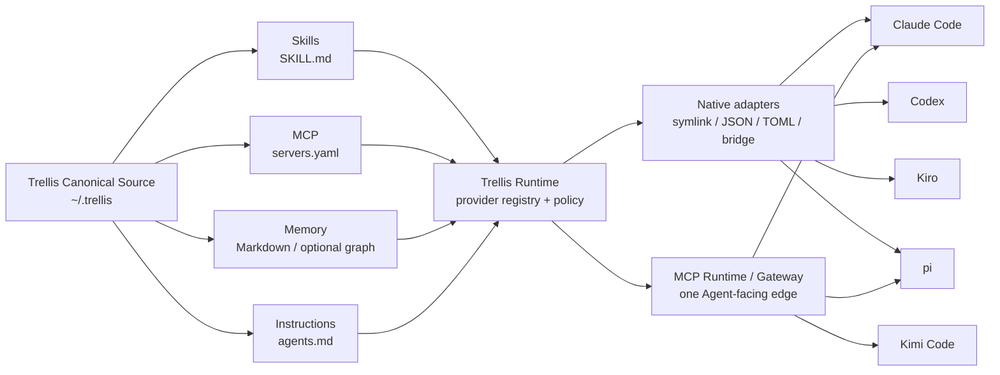

# Trellis

[English](overview.md) · [简体中文](overview.zh-CN.md)

## One-line description

> Trellis is a unified Code Agent Runtime for managing Skills, MCP, Memory, and shared instructions across Claude Code, Codex, Kiro, pi, and Kimi Code.

中文定位：

> Trellis 是统一的 Code Agent Runtime，为 Claude Code、Codex、Kiro、pi 和 Kimi Code 统一管理 Skill、MCP、Memory 与共享指令。

## Quick start

### Install

```bash
npm install -g agent-trellis
```

### Onboard an existing machine

Preview first:

```bash
trellis onboard --dry-run
```

Apply after reviewing the source Agent, managed Agents, MCP mode, and Memory choice:

```bash
trellis onboard
```

### Inspect and verify

```bash
trellis doctor
trellis secrets audit
trellis sync --dry-run
trellis mcp sync --dry-run
```

### Import an MCP Router export

```bash
trellis mcp import ~/Desktop/mcp-servers.json --dry-run
trellis mcp import ~/Desktop/mcp-servers.json
```

The importer de-duplicates existing servers, extracts environment credentials into the ignored local secret file, converts supported `mcp-remote` Basic Auth entries to native HTTP MCP, and skips unavailable legacy paths.

## Architecture


The overview shows the product boundary: Trellis is the control plane in the center; Skills, MCP, Memory, and Instructions are managed capability sources; Agents consume the resulting native or Runtime views.

Brand and social assets, including the minimal poster series, live in [`docs/assets/poster-series/`](assets/poster-series/README.md).



### Ownership boundary

- `~/.trellis/` is the canonical source and policy boundary.
- Native Agent directories are projections, not independent sources of truth.
- Gateway/Runtime owns connection routing and provider exposure, not Agent private sessions.
- Secrets remain outside canonical YAML and are resolved at runtime.
- Runtime providers treat Memory, MCP output, and task records as untrusted context.

## Delivery modes

| Mode | Meaning | Typical use |
|---|---|---|
| `native` | Project capabilities into the Agent's native configuration | Maximum native compatibility |
| `mcp` | Consume Trellis capabilities through the Runtime MCP edge | Runtime-first Agents such as Kimi Code |
| `both` | Keep native and Runtime delivery during a transition | Compatibility migration |

## Similar products

Trellis is intentionally a composition layer, not a replacement for every adjacent product.

| Product/category | Primary focus | What Trellis adds or differs |
|---|---|---|
| Rules/Skills sync tools | Share instruction files or Skills across Agents | Adds MCP, Memory, secrets policy, Agent lifecycle, Runtime providers, and verification |
| [MCP Router](https://github.com/mcp-router/mcp-router) | Desktop MCP server management, workspaces, provider toggles, and logs | Trellis makes canonical MCP state the source of truth and adapts it to multiple Agents; MCP Router can remain an import source or upstream |
| [MetaMCP](https://github.com/metatool-ai/metamcp) / [mcp-hub](https://github.com/ravitemer/mcp-hub) | Aggregate many MCP servers behind one endpoint | Trellis combines aggregation with native Agent adapters, ownership-safe sync, OAuth routing, and built-in providers |
| [OpenViking](https://github.com/volcengine/OpenViking) / context databases | Store and retrieve Memory, resources, and Skills through a navigable context space | Trellis defines the Agent-facing control plane and can later mount OpenViking behind the Memory/Context provider contract |
| Agent orchestration platforms | Launch workers, schedule tasks, and coordinate execution | Trellis currently provides durable task handoff records and leases without implicit remote Agent execution; execution is a deliberate future layer |

## Language and terminology

Documentation uses stable English identifiers for commands, files, types, and protocol names. Explanations can be translated without changing these identifiers:

- Code Agent Runtime / Agent Runtime
- canonical source
- native adapter
- Runtime delivery
- Skill / MCP / Memory / Instructions
- gateway / hub / direct
- managed Agent / unmanaged Agent

Use the language switch in the documentation entrypoints when translations are added. Keep command examples and configuration keys unchanged across languages.

## Learn more

- [Getting started](getting-started.md) — complete onboarding and migration guide
- [Architecture](architecture.md) — implementation layers and adapter contracts
- [Research](research.md) — ecosystem comparison and design rationale
- [Roadmap](roadmap.md) — verified milestones and remaining work
