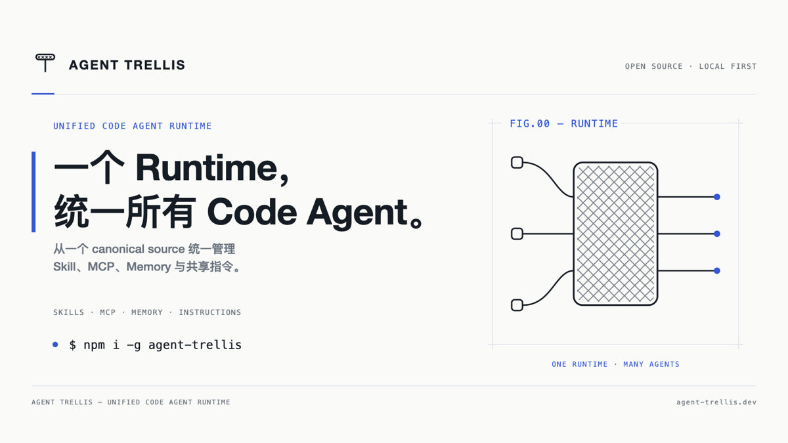

# Trellis

[English](overview.md) · [简体中文](overview.zh-CN.md)

## 一句话介绍

> Trellis 是统一的 Code Agent Runtime，为 Claude Code、Codex、Kiro、pi 和 Kimi Code 统一管理 Skill、MCP、Memory 与共享指令。

## 快速开始

### 安装

```bash
npm install -g agent-trellis
```

### 接管已有环境

先预览：

```bash
trellis onboard --dry-run
```

确认迁移源、托管 Agent、MCP 模式和 Memory 选项后执行：

```bash
trellis onboard
```

### 检查状态

```bash
trellis doctor
trellis secrets audit
trellis sync --dry-run
trellis mcp sync --dry-run
```

### 导入 MCP Router 配置

```bash
trellis mcp import ~/Desktop/mcp-servers.json --dry-run
trellis mcp import ~/Desktop/mcp-servers.json
```

导入器会自动去重、提取凭证、转换支持的 `mcp-remote` Basic Auth，并跳过本机不存在的历史路径。

## 架构



Trellis 以 `~/.trellis/` 为 canonical source，在中心统一管理四类能力：

- Skill：可复用的 Agent 工作方法；
- MCP：工具、数据源和外部服务；
- Memory：canonical Markdown 以及可选的共享图数据库；
- Instructions：跨 Agent 生效的全局指令。

这些能力通过 native adapter 或 Runtime/Gateway 投递给不同的 Code Agent。

品牌与社媒海报资源见 [`docs/assets/poster-series-v3/`](assets/poster-series-v3/README.md)，包含竖版（手机端）与横版（桌面端）海报的中英文版本。

```text
~/.trellis/ canonical source
        │
        ▼
Trellis Runtime / Gateway
        │
        ├── Native adapters ── Claude Code / Codex / Kiro / pi
        └── MCP Runtime ────── Kimi Code / 其他 Runtime-first Agent
```

## 与相似产品的关系

| 产品/类别 | 主要解决的问题 | Trellis 的区别 |
|---|---|---|
| Rules / Skills 同步工具 | 共享规则和 Skill 文件 | 进一步统一 MCP、Memory、凭证策略、托管边界和验证 |
| [MCP Router](https://github.com/mcp-router/mcp-router) | 桌面 MCP 管理、Workspace、Provider 和日志 | 可作为 Trellis 的导入源或上游；Trellis 自己维护 canonical MCP 状态 |
| [MetaMCP](https://github.com/metatool-ai/metamcp) / [mcp-hub](https://github.com/ravitemer/mcp-hub) | MCP 聚合和统一入口 | Trellis 额外负责不同 Agent 的 native 适配、生命周期和安全同步 |
| [OpenViking](https://github.com/volcengine/OpenViking) | Memory、资源和 Skill 的上下文数据库 | Trellis 可将其接入 Memory/Context Provider，作为底层上下文服务 |

## 术语约定

命令、配置键、文件名和协议名称统一保留英文，解释文字可以翻译：

- Code Agent Runtime / Agent Runtime
- canonical source
- native adapter
- Runtime delivery
- Skill / MCP / Memory / Instructions
- gateway / hub / direct
- managed Agent / unmanaged Agent

这样不同语言的文档可以共享同一组命令和配置示例，避免翻译造成操作差异。

## 深入阅读

- [完整上手指南](getting-started.md)
- [架构说明](architecture.md)
- [技术调研](research.md)
- [路线图](roadmap.md)
